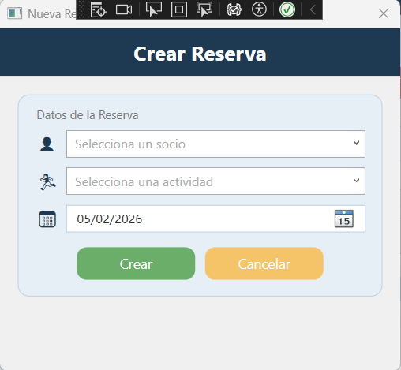
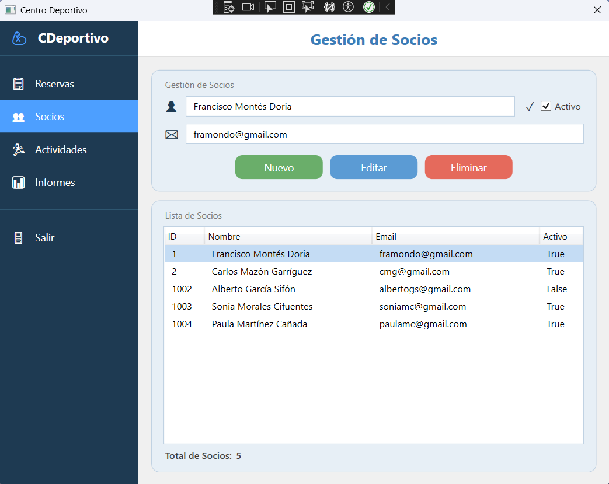
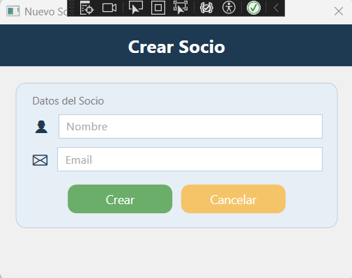
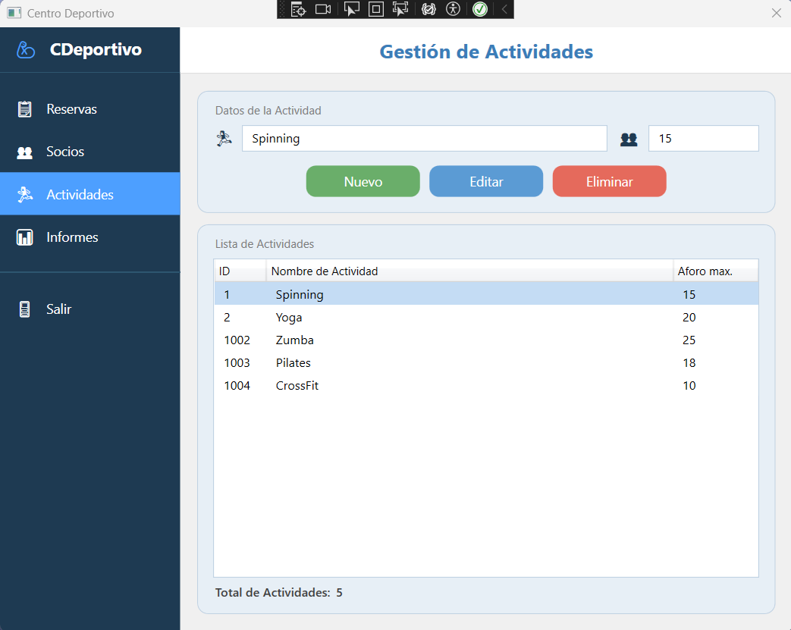
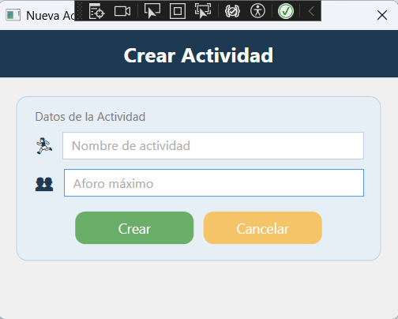
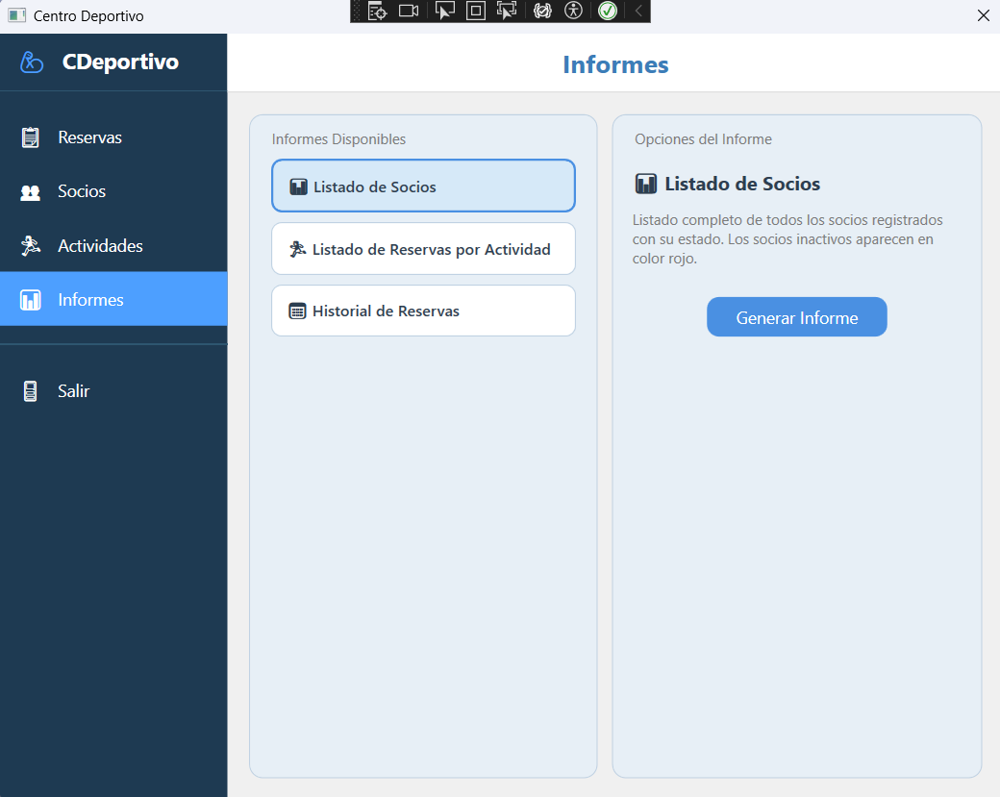
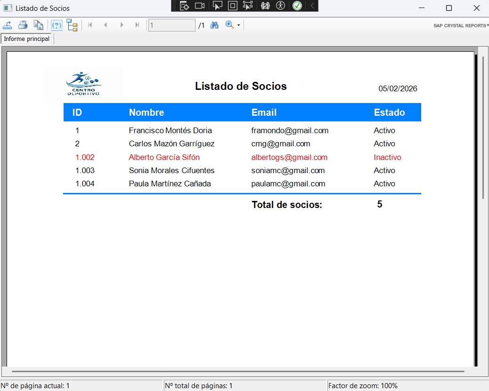
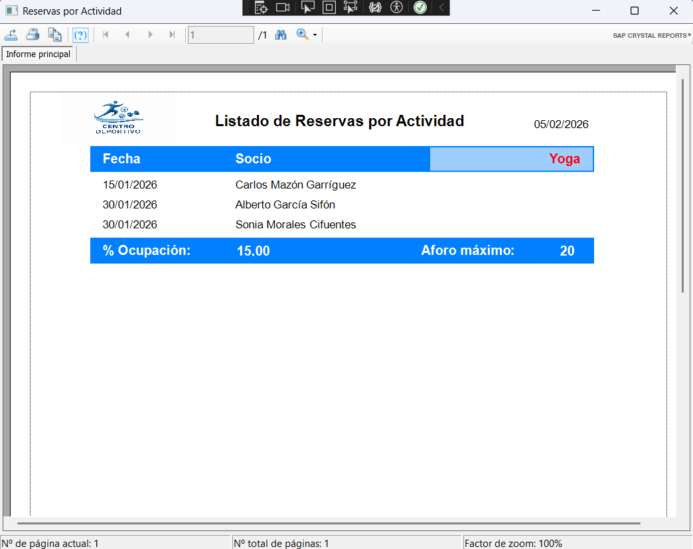
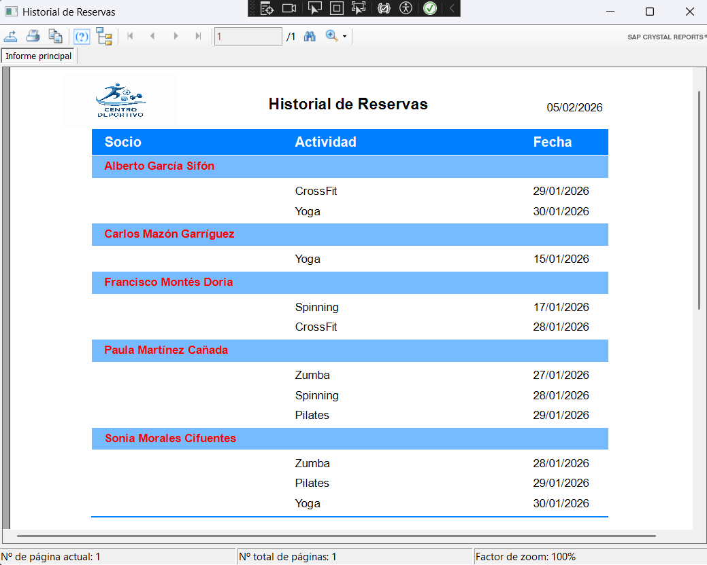

# 🏋️ Centro Deportivo - Sistema de Gestión

[](https://dotnet.microsoft.com/download/dotnet-framework/net48)
[](https://docs.microsoft.com/en-us/dotnet/desktop/wpf/)
[](https://docs.microsoft.com/en-us/ef/ef6/)
[](LICENSE)


## 📖 Documentación del Código (Doxygen)

**➡️ [Documentación API Generada por Doxygen](https://htmlpreview.github.io/?https://github.com/fmontesdev/CentroDeportivo_WPF_NetFramework_MVVM/blob/master/docs/html/index.html)**

Documentación técnica completa del código fuente, generada automáticamente con Doxygen. Incluye documentación completa de clases, métodos y propiedades

> **💡 Nota**: La documentación Doxygen se abre en una nueva pestaña mediante [htmlpreview.github.io](https://htmlpreview.github.io/), un servicio que permite visualizar archivos HTML alojados en GitHub. Para un acceso más rápido, acceder a la ubicación de la documentación en el directorio `/docs/html/index.html`


## 📖 Documentación Técnica y Manual de Usuario

**➡️ <a href="https://paco-montes.gitbook.io/paco-montes-docs" target="_blank" rel="noopener noreferrer">Documentación Completa en GitBook</a>**

Accede a la documentación completa del proyecto, incluyendo: documentación técnica, y manual de usuario en formato web interactivo.


## 🎯 Descripción del Proyecto

Aplicación de escritorio para la gestión de un centro deportivo, desarrollada con **WPF** y **.NET Framework 4.8** siguiendo el patrón arquitectónico **MVVM**. Permite gestionar todas las operaciones diarias de un centro deportivo, incluyendo:

- **Gestión de Socios**: Control completo de altas, bajas y modificaciones de socios
- **Gestión de Actividades**: Administración de actividades deportivas con control de aforo
- **Sistema de Reservas**: Reservas en tiempo real con validación automática de disponibilidad
- **Generación de Informes**: Informes profesionales con Crystal Reports

La aplicación implementa validaciones, manejo de errores y una interfaz de usuario intuitiva diseñada con Material Design.


## 🚀 Tecnologías

### **Frontend**
- **WPF** (Windows Presentation Foundation) - Interfaz de usuario moderna
- **XAML** - Diseño declarativo de interfaces

### **Backend**
- **.NET Framework 4.8** - Framework principal
- **C# 7.3** - Lenguaje de programación
- **Entity Framework 6** - ORM para acceso a datos (Database First)
- **LINQ** - Consultas integradas

### **Base de Datos**
- **SQL Server** - Sistema de gestión de base de datos

### **Informes**
- **Crystal Reports** - Generación de informes profesionales
- **DataSets tipados** - Origen de datos para informes

### **Patrones y Arquitectura**
- **MVVM** (Model-View-ViewModel) - Patrón arquitectónico
- **Repository Pattern** - Abstracción de acceso a datos
- **Command Pattern** - Implementación de acciones
- **Dependency Injection** - Inyección manual de dependencias

### **Testing**
- **MSTest** - Framework de pruebas unitarias

### **Documentación**
- **Comentarios XML** - Documentación inline del código
- **Doxygen Ready** - Preparado para generación automática de documentación


## 📁 Estructura del Proyecto

```
CentroDeportivo/
├── View/				# Vista (WPF)
├── ViewModel/          # Lógica de presentación
├── Model/              # Acceso a datos y entidades
├── Reports/            # Informes Crystal Reports
└── Testing/            # Tests unitarios (MSTest)
```

## Funcionalidades

### 📋 Gestión de Socios
- Crear, editar y eliminar socios
- Activar/desactivar socios
- Listado completo con búsqueda

### 🏃 Gestión de Actividades
- Crear, editar y eliminar actividades
- Control de aforo máximo
- Gestión de horarios

### 📅 Gestión de Reservas
- Crear y eliminar reservas
- Validación de aforo
- Filtrado por socio y actividad

### 📊 Informes
1. **Listado de Socios**: Reporte completo de socios registrados
2. **Reservas por Actividad**: Hoja de asistencia con cálculo de ocupación
3. **Historial de Reservas**: Historial completo agrupado por socio


## Testing

El proyecto incluye un conjunto de **tests unitarios** (MSTest) que validan la lógica de negocio y las reglas de validación:

### 🧪 Tests Implementados

#### 1. **TestFormatoEmail** - Validación de Emails
Verifica que el sistema solo acepte direcciones de correo electrónico válidas al crear socios.

- **TestEmailsValidos_RetornaTrue**: Valida emails con formato correcto
  - Ejemplos: `ana.gomez@dominio.com`, `usuario@mail.dominio.com`
- **TestEmailsInvalidos_RetornaFalse**: Rechaza emails con formato incorrecto
  - Ejemplos: `usuario.com`, `usuario@`, `usuario@dominio`, `usuario @dominio.com`

#### 2. **TestFechaReserva** - Validación de Fechas
Garantiza que las reservas solo se puedan crear para fechas futuras o el día actual.

- **TestFechasValidas_RetornaTrue**: Acepta fechas de hoy o futuras
  - Ejemplos: Hoy, mañana, próxima semana, próximo mes
- **TestFechasInvalidas_RetornaFalse**: Rechaza fechas pasadas
  - Ejemplos: Ayer, semana pasada, mes pasado
- **TestFechaNull_RetornaFalse**: Rechaza fechas nulas
- **TestFechaAyer_MensajeError**: Verifica que se muestre el mensaje de error correcto

#### 3. **TestAforoMaximo** - Control de Aforo
Valida que el sistema respete el aforo máximo de las actividades y no permita sobrecupo.

- **TestControlAforo_ActividadConAforoUno_SegundaReservaDenegada**: 
  - Crea una actividad con aforo máximo de 1 persona
  - Permite la primera reserva exitosamente
  - Rechaza la segunda reserva para la misma actividad y fecha
  - Verifica que se lance `InvalidOperationException` con mensaje apropiado
  - Asegura que no se persista la reserva rechazada en la base de datos

### 📊 Ejecución de Tests

**En Visual Studio:**
```
Pruebas → Ejecutar todas las pruebas
```

**Desde la terminal:**
```powershell
dotnet test
```

### ✅ Cobertura de Tests

Los tests cubren:
- ✔️ Validación de formularios (emails, fechas)
- ✔️ Reglas de negocio (control de aforo)
- ✔️ Integración con base de datos (CRUD completo)
- ✔️ Manejo de excepciones
- ✔️ Limpieza automática de datos de prueba

---

## 📸 Capturas de Pantalla

### Pantalla Principal - Gestión de Reservas


*Vista principal con listado de reservas, filtros y opciones de gestión*

### Creación de Nueva Reserva



*Ventana modal con ComboBox filtrables para socio y actividad*

### Gestión de Socios



*CRUD completo de socios con validación de email*

### Creación de Nuevo Socio



*Ventana modal con formulario para la introducción del nombre y email del nuevo socio*

### Gestión de Actividades



*Administración de actividades con control de aforo máximo*

### Creación de Nueva Actividad



*Ventana modal con formulario para la introducción del nombre de actividad y aforo máximo*

### Generación de Informes



*Selección y vista previa de informes con Crystal Reports*

### Informe de Listado de Socios



*Informe con todos los socios registrados*

### Listado de reservas por actividad



*Informe de reservas por actividad seleccionada. Con anotación de aforo máximo, y % de ocupación de la actividad*

### Historial de reservas



*Informe con el historial de reservas agrupadas por socio, y ordenadas cronológicamente*

> **Nota**: Las capturas de pantalla se encuentran en la carpeta `docs/screenshots/`. Si las imágenes no se visualizan correctamente, asegúrate de tener acceso al repositorio.

---

## 💻 Requisitos del Sistema

### **Software Necesario**
- ✅ **Windows 10** o superior (64-bit recomendado)
- ✅ **.NET Framework 4.8** Runtime o superior
- ✅ **Conexión a Internet** (para acceso a base de datos remota)
- ✅ **Visual Studio 2019/2022** (para desarrollo)
- ✅ **Crystal Reports Runtime** (para visualizar informes)

### **Infraestructura de Base de Datos**
- 🌐 **SQL Server 2022** alojado en VPS remoto
- 🔐 Autenticación SQL Server (usuario y contraseña)
- 🌍 Acceso remoto configurado en el servidor

---

## 🔧 Instalación y Configuración

### **Paso 1: Clonar el Repositorio**
```bash
git clone https://github.com/fmontesdev/CentroDeportivo_WPF_NetFramework_MVVM.git
cd CentroDeportivo
```

### **Paso 2: Configurar la Conexión a la Base de Datos Remota**

> ⚠️ **Importante**: La aplicación se conecta a una base de datos **SQL Server 2022** alojada en un **VPS remoto**. No es necesario instalar SQL Server localmente.

1. **Requisitos de conexión**:
   - La base de datos `CentroDeportivo` ya está configurada en el servidor remoto
   - Se requiere autenticación SQL Server (usuario y contraseña)
   - El firewall del VPS permite conexiones remotas al puerto SQL Server (por defecto 1313)

2. **Configurar la cadena de conexión**:
   - Abre el archivo `CentroDeportivo/App.config`
   - Configura la cadena de conexión con los datos del servidor remoto:
   
```xml
<connectionStrings>
  <add name="CentroDeportivoEntities" 
       connectionString="metadata=res://*/CentroDeportivo.csdl|res://*/CentroDeportivo.ssdl|res://*/CentroDeportivo.msl;
       provider=System.Data.SqlClient;
       provider connection string=&quot;
       data source=IP_O_DOMINIO_VPS,1313;
       initial catalog=CentroDeportivo;
       user id=TU_USUARIO;
       password=TU_CONTRASEÑA;
       MultipleActiveResultSets=True;
       Encrypt=True;
       TrustServerCertificate=True;
       App=EntityFramework&quot;" 
       providerName="System.Data.EntityClient" />
</connectionStrings>
```

   **Parámetros de conexión**:
   - `data source`: Dirección IP o dominio del VPS seguido del puerto (ejemplo: `192.168.1.100,1313` o `miservidor.com,1313`)
   - `initial catalog`: Nombre de la base de datos (`CentroDeportivo`)
   - `user id`: Usuario de SQL Server configurado en el VPS
   - `password`: Contraseña del usuario SQL Server
   - `Encrypt=True`: Habilita encriptación SSL/TLS para la conexión
   - `TrustServerCertificate=True`: Permite certificados autofirmados

### **Paso 3: Restaurar Paquetes NuGet**
```bash
# En Visual Studio
Herramientas → Administrador de paquetes NuGet → Consola del Administrador de paquetes
> Update-Package -reinstall

# O desde la terminal
dotnet restore
```

### **Paso 4: Compilar la Solución**
```bash
# En Visual Studio
Compilar → Recompilar solución (Ctrl+Shift+B)

# O desde la terminal
msbuild CentroDeportivo.sln /p:Configuration=Release
```

---

## ▶️ Cómo Ejecutar la Aplicación

### **Desde Visual Studio**
1. Abre `CentroDeportivo.sln` en Visual Studio
2. Establece `CentroDeportivo` (View) como proyecto de inicio
3. Presiona `F5` o haz clic en **Iniciar depuración**

### **Ejecutable Compilado**
1. Navega a la carpeta de compilación:
   ```
   CentroDeportivo/bin/Debug/
   ```
   o
   ```
   CentroDeportivo/bin/Release/
   ```
2. Ejecuta `CentroDeportivo.exe`

### **Pruebas Unitarias**
```bash
# En Visual Studio
Pruebas → Ejecutar todas las pruebas (Ctrl+R, A)

# Desde la terminal
dotnet test Testing/Testing.csproj
```

---

## 🗄️ Base de Datos

La aplicación utiliza **Entity Framework 6 Database First**. El modelo de datos se genera automáticamente desde la base de datos `CentroDeportivo`.

### **Esquema de Base de Datos**

#### **Tabla: Socio**
| Campo | Tipo | Descripción |
|-------|------|-------------|
| `IdSocio` | INT (PK) | Identificador único |
| `Nombre` | NVARCHAR(100) | Nombre completo |
| `Email` | NVARCHAR(100) | Correo electrónico |
| `Activo` | BIT | Estado del socio |

#### **Tabla: Actividad**
| Campo | Tipo | Descripción |
|-------|------|-------------|
| `IdActividad` | INT (PK) | Identificador único |
| `Nombre` | NVARCHAR(100) | Nombre de la actividad |
| `AforoMaximo` | INT | Capacidad máxima |

#### **Tabla: Reserva**
| Campo | Tipo | Descripción |
|-------|------|-------------|
| `IdReserva` | INT (PK) | Identificador único |
| `IdSocio` | INT (FK) | Referencia al socio |
| `IdActividad` | INT (FK) | Referencia a la actividad |
| `Fecha` | DATETIME | Fecha de la reserva |

### **Relaciones**
- **Socio** 1:N **Reserva** (Un socio puede tener múltiples reservas)
- **Actividad** 1:N **Reserva** (Una actividad puede tener múltiples reservas)
- Restricción: No se permite eliminar un socio con reservas activas
- Restricción: No se permite eliminar una actividad con reservas activas

---

## 🏗️ Arquitectura

El proyecto sigue el patrón **MVVM** con separación clara de responsabilidades:

- **Model**: Entidades, Repositorios y DataSets
- **ViewModel**: Lógica de negocio y Commands
- **View**: Interfaz de usuario (XAML + Code-behind)
- **Reports**: Informes Crystal Reports

---

## 👨‍💻 Autor

**Francisco Montes**  
🔗 GitHub: [@fmontesdev](https://github.com/fmontesdev)  
📧 Email: [contacto](mailto:francisco.montes@example.com)  
🌐 LinkedIn: [Francisco Montes](https://www.linkedin.com/in/franciscomontes)

---

## 📄 Licencia

Este proyecto está bajo la Licencia MIT. Consulta el archivo [LICENSE](LICENSE) para más detalles.

```
MIT License

Copyright (c) 2026 Francisco Montes

Permission is hereby granted, free of charge, to any person obtaining a copy
of this software and associated documentation files (the "Software"), to deal
in the Software without restriction, including without limitation the rights
to use, copy, modify, merge, publish, distribute, sublicense, and/or sell
copies of the Software, and to permit persons to whom the Software is
furnished to do so, subject to the following conditions:

The above copyright notice and this permission notice shall be included in all
copies or substantial portions of the Software.

THE SOFTWARE IS PROVIDED "AS IS", WITHOUT WARRANTY OF ANY KIND, EXPRESS OR
IMPLIED, INCLUDING BUT NOT LIMITED TO THE WARRANTIES OF MERCHANTABILITY,
FITNESS FOR A PARTICULAR PURPOSE AND NONINFRINGEMENT. IN NO EVENT SHALL THE
AUTHORS OR COPYRIGHT HOLDERS BE LIABLE FOR ANY CLAIM, DAMAGES OR OTHER
LIABILITY, WHETHER IN AN ACTION OF CONTRACT, TORT OR OTHERWISE, ARISING FROM,
OUT OF OR IN CONNECTION WITH THE SOFTWARE OR THE USE OR OTHER DEALINGS IN THE
SOFTWARE.
```

<div align="center">

[⬆ Volver arriba](#-centro-deportivo---sistema-de-gestión)

</div>
