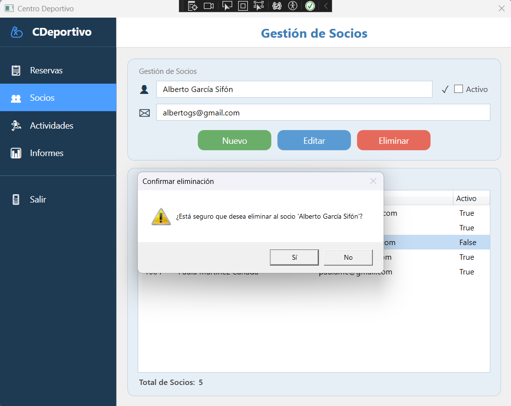
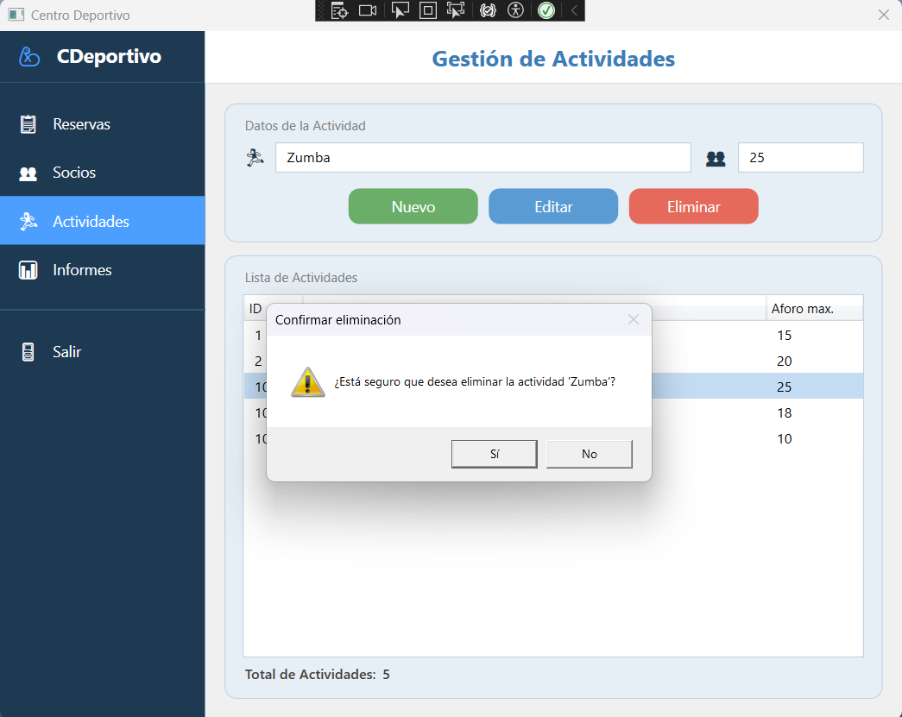
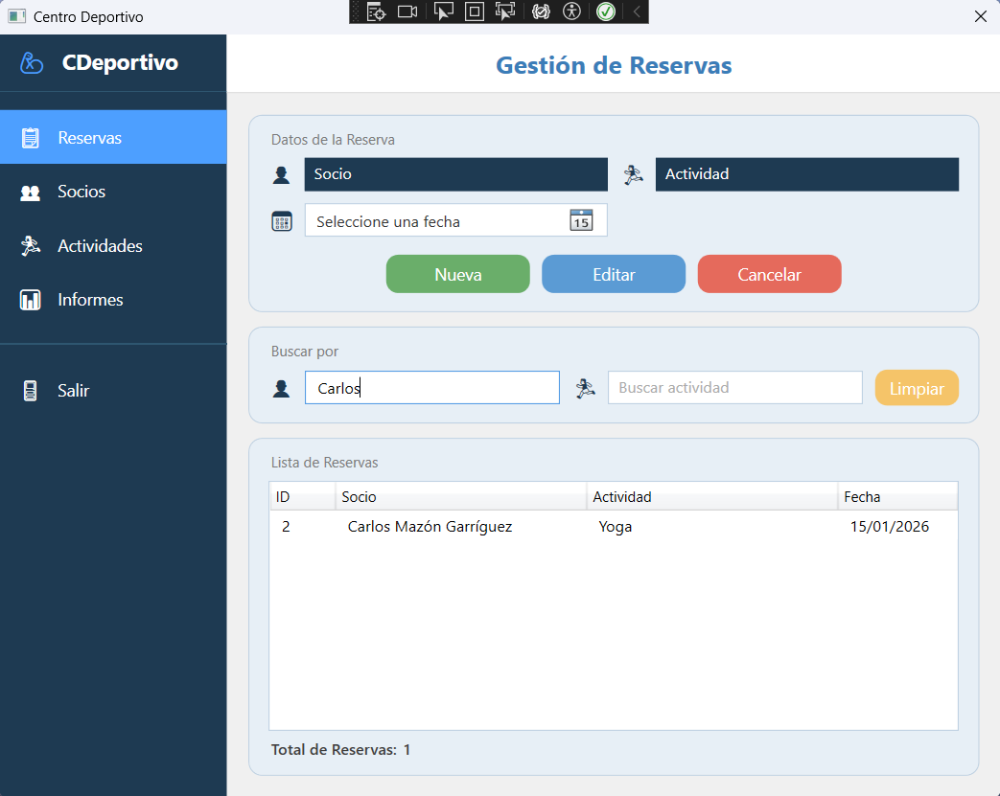
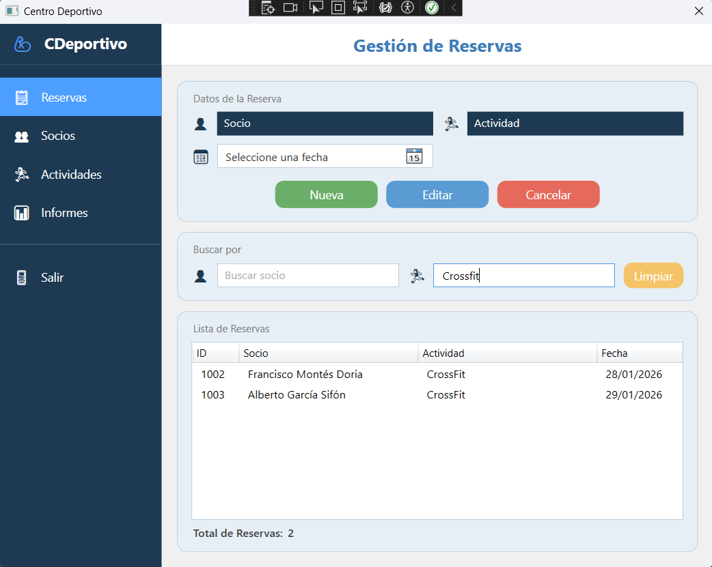
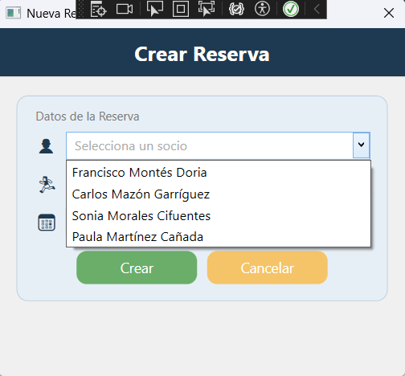
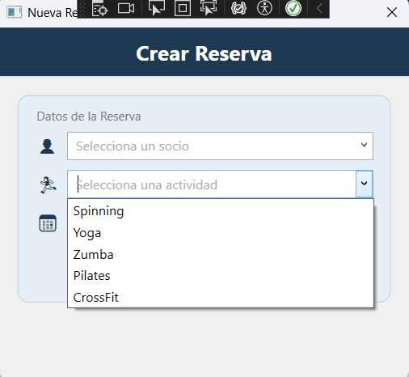
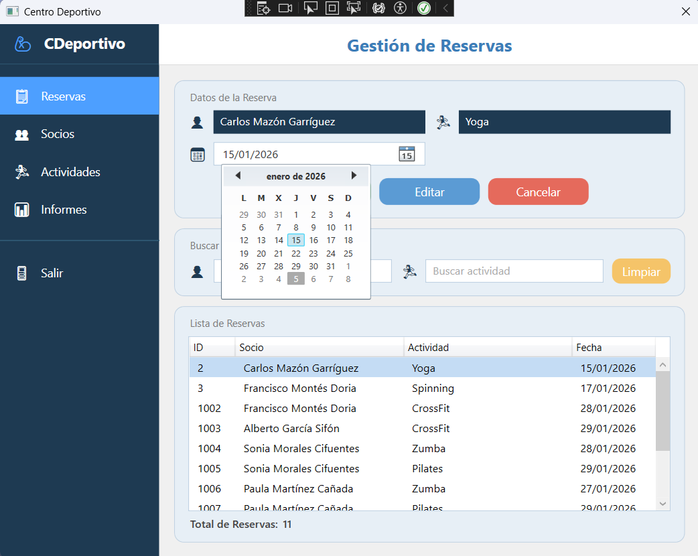
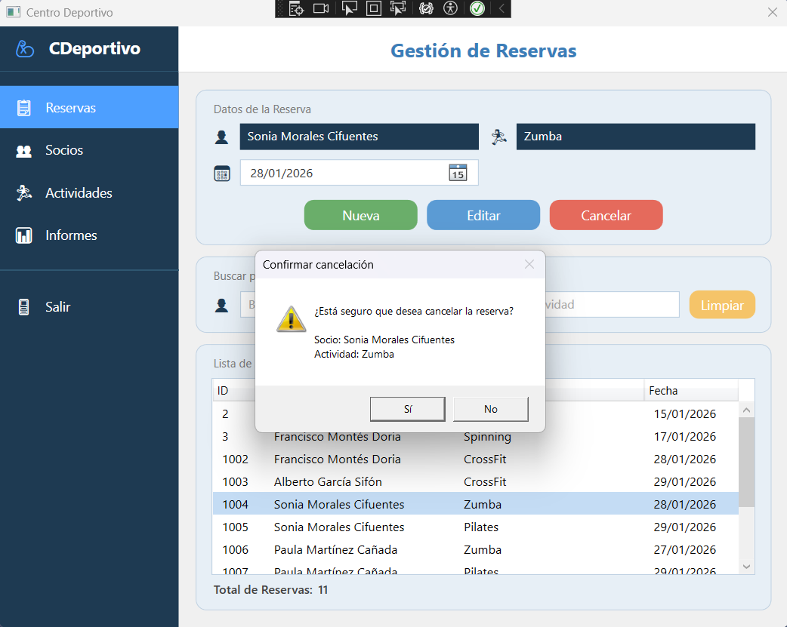
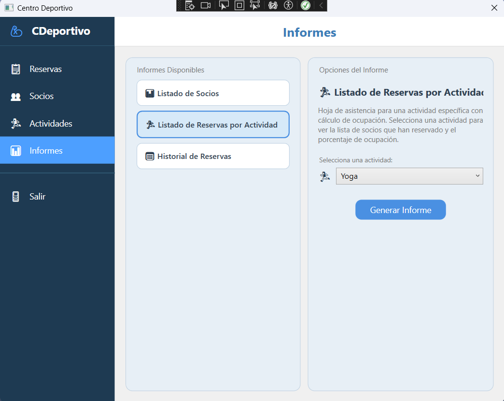
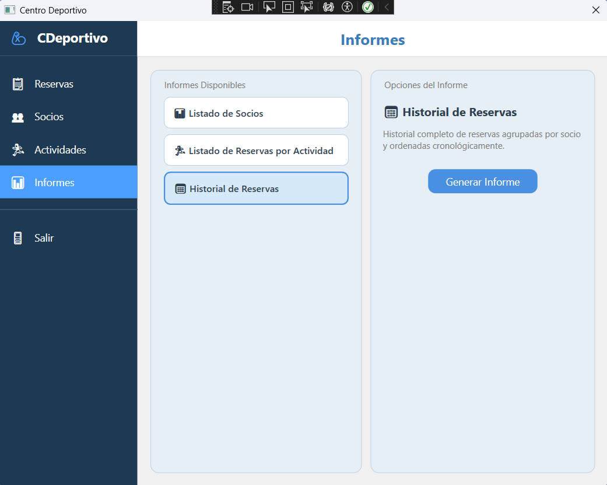

# 📖 Manual de Usuario - Centro Deportivo

## Sistema de Gestión de Centro Deportivo

**Versión:** 1.0  
**Fecha:** Febrero 2026  

---

## 📑 Tabla de Contenidos

1. [Introducción](#1-introducción)
2. [Inicio de la Aplicación](#2-inicio-de-la-aplicación)
3. [Gestión de Socios](#3-gestión-de-socios)
4. [Gestión de Actividades](#4-gestión-de-actividades)
5. [Gestión de Reservas](#5-gestión-de-reservas)
6. [Generación de Informes](#6-generación-de-informes)

---

## 1. Introducción

### 1.1 ¿Qué es Centro Deportivo?

**Centro Deportivo** es una aplicación de escritorio que permite gestionar de forma eficiente todas las operaciones diarias del centro deportivo:

- ✅ Registro y gestión de socios
- ✅ Administración de actividades deportivas
- ✅ Control de reservas con validación de aforo
- ✅ Generación de informes profesionales

### 1.2 Requisitos Previos

Antes de comenzar, asegúrate de tener:

- ✅ Windows 10 o superior
- ✅ Aplicación **CentroDeportivo.exe** instalada
- ✅ Conexión a internet (para acceso a la base de datos)
- ✅ Credenciales de acceso (si aplica)

---

## 2. Inicio de la Aplicación

### 2.1 Abrir la Aplicación

**Opción 1: Desde el Escritorio**

1. Busca el icono de **Centro Deportivo** en el escritorio
2. Haz **doble clic** en el icono
3. La aplicación se abrirá automáticamente

**Opción 2: Desde el Menú Inicio**

1. Haz clic en el **botón de Inicio** de Windows
2. Busca **"Centro Deportivo"**
3. Haz clic en la aplicación

**Opción 3: Desde la Carpeta de Instalación**

1. Navega a la carpeta donde se instaló la aplicación (por defecto: `C:\Program Files\CentroDeportivo\`)
2. Busca el archivo **CentroDeportivo.exe**
3. Haz **doble clic** para ejecutar

### 2.2 Pantalla Principal

Al abrir la aplicación, verás la **ventana principal** con las siguientes opciones en el menú lateral:

- 📅 **Reservas** - Gestión de reservas
- 👥 **Socios** - Gestión de socios
- 🏃 **Actividades** - Gestión de actividades
- 📊 **Informes** - Generación de informes

<br>

<br>
<br>

> 💡 **Consejo**: Por defecto, la aplicación abre la vista de **Reservas**, que es la más utilizada.

---

## 3. Gestión de Socios

### 3.1 Ver Listado de Socios

1. En el menú lateral, haz clic en **👥 Socios**
2. Se mostrará una tabla con todos los socios registrados
3. La tabla muestra:
   - **Nombre** del socio
   - **Email** de contacto
   - **Estado** (Activo/Inactivo)

<br>

<br>

### 3.2 Crear un Nuevo Socio

#### Paso 1: Abrir la ventana de nuevo socio

1. En la vista de **Socios**, haz clic en el botón **➕ Nuevo**
2. Se abrirá una ventana emergente

<br>

<br>

#### Paso 2: Completar el formulario

Completa los siguientes campos:

| Campo | Descripción | Obligatorio | Ejemplo |
|-------|-------------|-------------|---------|
| **Nombre** | Nombre completo del socio | ✅ Sí | Juan Pérez García |
| **Email** | Correo electrónico válido | ✅ Sí | juan.perez@gmail.com |

#### Paso 3: Guardar el socio

1. Verifica que todos los datos sean correctos
2. Haz clic en el botón **💾 Crear**
3. Si todo es correcto, verás un mensaje de confirmación
4. La ventana se cerrará automáticamente
5. El nuevo socio aparecerá en la lista

> ⚠️ **Importante**: El email debe ser único. No se pueden registrar dos socios con el mismo email.

### 3.3 Editar un Socio Existente

#### Paso 1: Seleccionar el socio

1. En la tabla de socios, haz **clic** sobre el socio que deseas modificar
2. Los datos del socio se cargarán en los campos de edición a la derecha

<br>

<br>

#### Paso 2: Modificar los datos

1. Cambia el **Nombre** o **Email** según necesites
2. Marca o desmarca la casilla **Activo** para cambiar el estado

#### Paso 3: Guardar los cambios

1. Haz clic en el botón **💾 Editar**
2. Si todo es correcto, los cambios se guardarán inmediatamente
3. La tabla se actualizará con la nueva información

> 💡 **Consejo**: Usa el estado "Inactivo" en lugar de eliminar socios para mantener el historial de reservas.

### 3.4 Eliminar un Socio

#### Paso 1: Seleccionar el socio

1. En la tabla, haz clic sobre el socio que deseas eliminar

#### Paso 2: Confirmar eliminación

1. Haz clic en el botón **🗑️ Eliminar**
2. Aparecerá un mensaje de confirmación:

   ```
   ¿Está seguro que desea eliminar al socio 'Juan Pérez'?
   ```

3. Haz clic en **Sí** para confirmar o **No** para cancelar

<br>

<br>
<br>

> ⚠️ **Restricción**: No se puede eliminar un socio que tenga reservas activas.

---

## 4. Gestión de Actividades

### 4.1 Ver Listado de Actividades

1. En el menú lateral, haz clic en **🏃 Actividades**
2. Se mostrará una tabla con todas las actividades registradas
3. La tabla muestra:
   - **Nombre** de la actividad
   - **Aforo Máximo** (capacidad)

<br>

<br>

### 4.2 Crear una Nueva Actividad

#### Paso 1: Abrir la ventana de nueva actividad

1. En la vista de **Actividades**, haz clic en el botón **➕ Nuevo**
2. Se abrirá una ventana emergente

<br>

<br>

#### Paso 2: Completar el formulario

Completa los siguientes campos:

| Campo | Descripción | Obligatorio | Ejemplo |
|-------|-------------|-------------|---------|
| **Nombre** | Nombre de la actividad | ✅ Sí | Yoga |
| **Aforo Máximo** | Capacidad máxima de personas | ✅ Sí | 15 |

#### Paso 3: Guardar la actividad

1. Verifica que los datos sean correctos
2. Haz clic en el botón **💾 Crear**
3. La nueva actividad aparecerá en la lista

> 📝 **Nota**: El aforo máximo debe ser un número entre 1 y 1000.

### 4.3 Editar una Actividad Existente

#### Paso 1: Seleccionar la actividad

1. En la tabla de actividades, haz clic sobre la actividad que deseas modificar
2. Los datos se cargarán en los campos de edición

<br>

<br>

#### Paso 2: Modificar los datos

1. Cambia el **Nombre** o **Aforo Máximo** según necesites

#### Paso 3: Guardar los cambios

1. Haz clic en el botón **💾 Editar**
2. Los cambios se guardarán inmediatamente

### 4.4 Eliminar una Actividad

1. Selecciona la actividad en la tabla
2. Haz clic en el botón **🗑️ Eliminar**
3. Confirma la eliminación en el mensaje emergente

<br>

<br>
<br>

> ⚠️ **Restricción**: No se puede eliminar una actividad que tenga reservas activas.

---

## 5. Gestión de Reservas

### 5.1 Ver Listado de Reservas

1. En el menú lateral, haz clic en **📅 Reservas** (vista por defecto)
2. Se mostrará una tabla con todas las reservas
3. La tabla muestra:
   - **Socio** (nombre del socio)
   - **Actividad** (nombre de la actividad)
   - **Fecha** de la reserva

<br>

<br>

### 5.2 Filtrar Reservas

Puedes filtrar las reservas por:

#### Filtro por Socio

1. En el campo **"Buscar por socio..."**, escribe el nombre del socio
2. La tabla se filtrará automáticamente mostrando solo las reservas de ese socio

<br>

<br>

#### Filtro por Actividad

1. En el campo **"Buscar por actividad..."**, escribe el nombre de la actividad
2. La tabla se filtrará automáticamente mostrando solo las reservas de esa actividad

<br>

<br>

#### Limpiar Filtros

1. Haz clic en el botón **🔄 Limpiar** para volver a ver todas las reservas

### 5.3 Crear una Nueva Reserva

#### Paso 1: Abrir la ventana de nueva reserva

1. En la vista de **Reservas**, haz clic en el botón **➕ Nueva**
2. Se abrirá una ventana emergente con el formulario de reserva

<br>

<br>

#### Paso 2: Seleccionar el socio

1. Haz clic en el campo **"Socio"**
2. Comienza a escribir el nombre del socio
3. Aparecerá una lista filtrada de socios activos
4. Selecciona el socio de la lista

<br>

<br>
<br>

> 💡 **Consejo**: Solo aparecen socios con estado **Activo**.

#### Paso 3: Seleccionar la actividad

1. Haz clic en el campo **"Actividad"**
2. Comienza a escribir el nombre de la actividad
3. Aparecerá una lista filtrada de actividades
4. Selecciona la actividad de la lista

<br>

<br>

#### Paso 4: Seleccionar la fecha

1. Haz clic en el campo **"Fecha"**
2. Se abrirá un calendario
3. Selecciona la fecha deseada

<br>

<br>
<br>

> ⚠️ **Restricción**: Solo se pueden seleccionar fechas de hoy en adelante. No se permiten fechas pasadas.

#### Paso 5: Crear la reserva

1. Verifica que todos los campos estén completos:
   - ✅ Socio seleccionado
   - ✅ Actividad seleccionada
   - ✅ Fecha seleccionada
2. Haz clic en el botón **💾 Crear**
3. Si todo es correcto, la reserva se guardará
4. La ventana se cerrará automáticamente
5. La nueva reserva aparecerá en la lista

### 5.4 Editar una Reserva

#### Paso 1: Seleccionar la reserva

1. En la tabla de reservas, haz clic sobre la reserva que deseas modificar
2. Los datos se cargarán en los campos de edición

<br>

<br>

#### Paso 2: Modificar la fecha

1. Selecciona una **nueva fecha** en el campo de fecha
2. No se puede cambiar el socio ni la actividad (solo la fecha)

<br>

<br>

#### Paso 3: Guardar los cambios

1. Haz clic en el botón **💾 Editar**
2. Los cambios se guardarán inmediatamente

> 📝 **Nota**: Para cambiar el socio o la actividad, es necesario cancelar la reserva y crear una nueva.

### 5.5 Cancelar una Reserva

#### Paso 1: Seleccionar la reserva

1. En la tabla, haz clic sobre la reserva que deseas cancelar

#### Paso 2: Confirmar cancelación

1. Haz clic en el botón **❌ Cancelar**
2. Aparecerá un mensaje de confirmación:

   ```
   ¿Está seguro que desea cancelar la reserva?
   
   Socio: Juan Pérez
   Actividad: Yoga
   ```

3. Haz clic en **Sí** para confirmar o **No** para cancelar

<br>

<br>

---

## 6. Generación de Informes

### 6.1 Acceder a la Vista de Informes

1. En el menú lateral, haz clic en **📊 Informes**
2. Se mostrará la lista de informes disponibles


### 6.2 Informes Disponibles

El sistema ofrece **3 tipos de informes**:

#### 6.2.1 Informe 1: Listado de Socios

**Descripción:** Reporte completo de todos los socios registrados en el sistema.

**Información que incluye:**
- Nombre completo
- Email de contacto
- Estado (Activo/Inactivo)
- Los socios inactivos aparecen destacados en rojo

**Cómo generarlo:**
1. Selecciona **"📊 Listado de Socios"** de la lista
2. Haz clic en el botón **🖨️ Generar Informe**
3. Se abrirá una ventana con la vista previa del informe

<br>

<br>
<br>

<br>

#### 6.2.2 Informe 2: Reservas por Actividad

**Descripción:** Hoja de asistencia para una actividad específica con cálculo de ocupación.

**Información que incluye:**
- Nombre de la actividad
- Lista de socios que han reservado
- Fecha de cada reserva
- Porcentaje de ocupación (reservas / aforo máximo)

**Cómo generarlo:**
1. Selecciona **"🏃 Listado de Reservas por Actividad"** de la lista
2. En el campo **"Selecciona una actividad"**, elige la actividad
3. Haz clic en el botón **🖨️ Generar Informe**
4. Se abrirá una ventana con la vista previa del informe

<br>

<br>
<br>

<br>
<br>

> 📝 **Nota**: Este informe requiere seleccionar una actividad antes de generarlo.

#### 6.2.3 Informe 3: Historial de Reservas

**Descripción:** Historial completo de reservas agrupadas por socio y ordenadas cronológicamente.

**Información que incluye:**
- Nombre del socio
- Lista de todas sus reservas
- Actividad de cada reserva
- Fecha de cada reserva
- Agrupación por socio

**Cómo generarlo:**
1. Selecciona **"📅 Historial de Reservas"** de la lista
2. Haz clic en el botón **🖨️ Generar Informe**
3. Se abrirá una ventana con la vista previa del informe

<br>

<br>
<br>

<br>

### 6.3 Opciones del Visor de Informes

Una vez generado el informe, el visor de Crystal Reports permite:

- 🖨️ **Imprimir** - Enviar el informe a una impresora
- 💾 **Exportar** - Guardar el informe en PDF, Excel, Word, etc.
- 🔍 **Zoom** - Acercar o alejar la vista
- 📄 **Navegar** - Ir a la primera, anterior, siguiente o última página
- 🔎 **Buscar** - Buscar texto dentro del informe

---

## 📄 Control de Versiones

| Versión | Fecha | Cambios |
|---------|-------|---------|
| 1.0 | Febrero 2026 | Versión inicial del manual de usuario |

---

<div align="center">

[⬆ Volver al inicio](#-manual-de-usuario---centro-deportivo)

</div>
